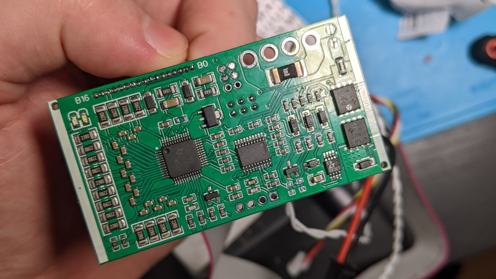

# WP_BMS
**placeholder picture**

This repository is dedicated to the documentation of the **%unnamed-bms%** project by SurgeSPB. 

The repository is split in two parts:
1. **[Hardware](Hardware)**
	The BMS is now out for a quite a long time, so multiple revisions exist. In this folder there are informations on individual parameters and differences of the different revisions and their parameters.
	It also contains information on what FW-versions are available
	**Never flash firmware other than noted**
2. **[Software](Software)**
	All existing BMS support configuration and firmware updating via bluetooth.
	The folder contains:
	  + The configuration tool used for the BMS, PowerNine
	  + Documentation on options available in Powernine, and how to use them
	  + Available firmwares to be used for different BMS revisions
	  
	  
## Features

|Parameter|Value|
| :--- |---:|
|Physical dimensions|65x35 mm|
|Peak discharge current|60 A|
|Max charge current|6 A|
|Cell balance current| 55 mA|
|Sections balanced at the same time | max 3|
|Balancing algorithm type|passive, 24/7 if no load is detected

This is a custom BMS, based on the stm G031 series. 
Its main feature is the **full support of the Ninebot/Xiaomi communication protocol**. 
It has a very small formfactor, and can deliver up to 60A peak current.
It's highly configurable, and can be configured according to the specific user scenario.
It is also possible to use it in stand-alone mode should you decide to ditch the ninebot ecosystem. 